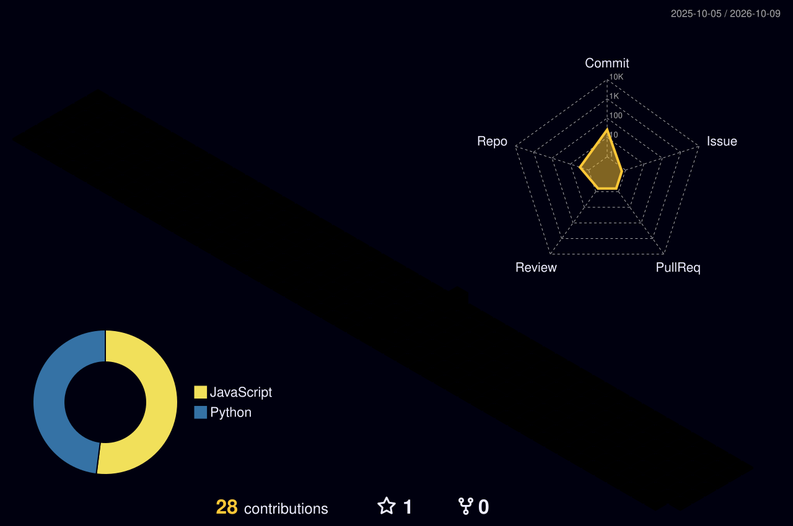

# M E R T &nbsp; K A R A K A Ş

**F U L L&nbsp;S T A C K** &nbsp;·&nbsp; **D E S I G N** &nbsp;·&nbsp; **B R A N D I N G** &nbsp;·&nbsp; **S E O**

 

&nbsp;

&nbsp;

 

## From idea to deployment.

FULL STACK DEVELOPMENT &nbsp;·&nbsp; GRAPHIC DESIGN &nbsp;·&nbsp; BRAND IDENTITY &nbsp;·&nbsp; SEO

 

**Frontend** &nbsp;&nbsp; React &nbsp;·&nbsp; Next.js &nbsp;·&nbsp; Vue.js &nbsp;·&nbsp; JavaScript &nbsp;·&nbsp; HTML &nbsp;·&nbsp; CSS

**Backend** &nbsp;&nbsp;&nbsp; Node.js &nbsp;·&nbsp; Python &nbsp;·&nbsp; REST API

**DevOps** &nbsp;&nbsp;&nbsp;&nbsp; Vercel &nbsp;·&nbsp; Docker &nbsp;·&nbsp; Git &nbsp;·&nbsp; GitHub

**Design** &nbsp;&nbsp;&nbsp;&nbsp; Figma &nbsp;·&nbsp; Photoshop &nbsp;·&nbsp; Illustrator

**Growth** &nbsp;&nbsp;&nbsp;&nbsp; Google Ads &nbsp;·&nbsp; Google Business &nbsp;·&nbsp; SEO

 

&nbsp;&nbsp;

&nbsp;&nbsp;

 

 

<b>🇹🇷 Hakkımda</b>

 

2020'den beri freelance çalışan **Full Stack Web Geliştirici & Grafik Tasarımcı**'yım.
Yerel işletmeler ve yurt dışı müşteriler için web siteleri, web uygulamaları ve
marka kimliği tasarımları geliştiriyorum. Hem geliştirici hem tasarımcı kimliğimle
projeleri **fikir aşamasından yayına kadar** tek başıma yönetiyorum.

- Modern, responsive web siteleri & uygulamalar
- Backend servisler & RESTful API geliştirme
- Logo & kurumsal grafik tasarım
- Mobil uygulama geliştirme
- Vercel ile CI/CD & deployment yönetimi

**Tam zamanlı pozisyonlara açığım** — mesaj göndermekten çekinmeyin.

<b>🇬🇧 About</b>

 

**Full Stack Web Developer & Graphic Designer** freelancing since 2020.
I build websites, web applications, and brand identities for local businesses and
international clients. Being both a developer and designer, I manage projects
**end-to-end** — from concept to deployment.

- Modern, responsive websites & web applications
- Backend services & RESTful API development
- Logo & corporate graphic design
- Mobile application development
- CI/CD & deployment management via Vercel

**Open to full-time opportunities** — feel free to reach out.

