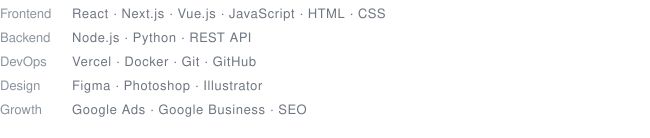
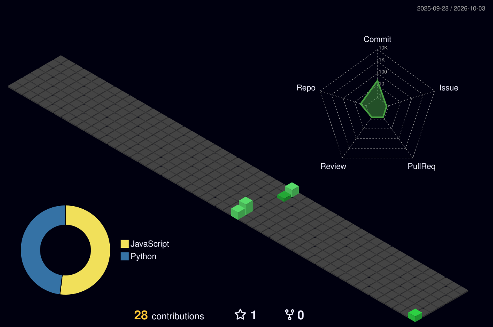

<picture>
  <source media="(prefers-color-scheme: dark)" srcset="./header-dark.svg">
  <source media="(prefers-color-scheme: light)" srcset="./header-light.svg">
  
</picture>

 

<a href="https://mertkarakasdev.github.io"><picture><source media="(prefers-color-scheme: dark)" srcset="./contact-website-dark.svg"><source media="(prefers-color-scheme: light)" srcset="./contact-website-light.svg"></picture></a>&nbsp;
<a href="https://www.linkedin.com/in/mertkarakasdev/"><picture><source media="(prefers-color-scheme: dark)" srcset="./contact-linkedin-dark.svg"><source media="(prefers-color-scheme: light)" srcset="./contact-linkedin-light.svg"></picture></a>&nbsp;
<a href="mailto:tugrulmertkarakas@gmail.com"><picture><source media="(prefers-color-scheme: dark)" srcset="./contact-email-dark.svg"><source media="(prefers-color-scheme: light)" srcset="./contact-email-light.svg"></picture></a>

 

<picture>
  <source media="(prefers-color-scheme: dark)" srcset="./disciplines-dark.svg">
  <source media="(prefers-color-scheme: light)" srcset="./disciplines-light.svg">
  
</picture>

 

<picture>
  <source media="(prefers-color-scheme: dark)" srcset="./tech-dark.svg">
  <source media="(prefers-color-scheme: light)" srcset="./tech-light.svg">
  
</picture>

&nbsp;&nbsp;&nbsp;&nbsp;&nbsp;&nbsp;&nbsp;&nbsp;&nbsp;&nbsp;&nbsp;&nbsp;&nbsp;&nbsp;&nbsp;&nbsp;&nbsp;&nbsp;&nbsp;&nbsp;&nbsp;&nbsp;&nbsp;&nbsp;&nbsp;&nbsp;&nbsp;&nbsp;&nbsp;&nbsp;

 

<picture>
  <source media="(prefers-color-scheme: dark)" srcset="./profile-3d-contrib/profile-night-green.svg">
  <source media="(prefers-color-scheme: light)" srcset="./profile-3d-contrib/profile-green.svg">
  
</picture>
